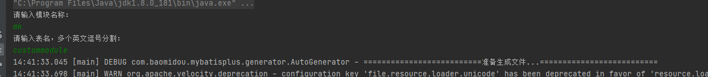
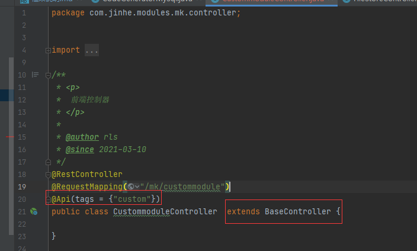

# 框架说明
#### 项目介绍

#### springboot-Application 一个以模版系统demo。

1. ssm整合完成MybatisPlus逆向 curd。
2. ssm整合完成MybatisPlus多数据源及事务控制例子。
3. ssm+RESTful API curd + swagger。
4. aop切面日志，待优化线程池异步打印。
5. 策略路由支付方式。
6. XSS，CSRF攻击的优雅防护机制
7. redis缓存
8. rabbitMq消息队列
9. 添加请求转发功能

#### 软件架构

springboot2.0、mybatis plus 、mysql redis缓存 rabbitMq druid

#### 安装教程

1. jdk1.8以上环境
2. idea
3. maven 3.6 以上版本

#### 使用说明

1. run Application 应用程序
2. http://localhost:8084/swagger-ui/# 查看接口说明
3. 查看system系统模块功能介绍
4. http://localhost:8084/druid/index.html druid 查询 默认帐号密码 admin Mas@12345

### 系统表名

``
dictionary,file_store,file_store_type,sys_log,sys_login_count,sys_login_log,sys_organ,sys_organ_role,sys_permission,sys_permission_item,sys_region,sys_resource,sys_resource_item,sys_role,sys_user,sys_user_organ,sys_app_permission,sys_app_resource
``
## 基本结构

+ com.jinhe 主目录
    + common 公共模块框架级别维护（一般开发人员不改 框架级别的修改）
        + annotation aop注解类
        + aspect aop切面方法
        + config 框架配置项
        + exception 自定义异常处理
        + util 工具类
        + XSS xss过滤
    + config 程序配置 开发人自己可以改的
    + datasources 多数据源配置
    + modules 业务功能模块
        + allowApi 不需要权限就可以访问的接口
        + base 基础控制器类 所有的控制器都要继承这个控制器
        + demo 演示使用的模块
        + login 登录模块
        + sys admin系统管理员模块
        + system rootAdmin 超级管理员使用模块
        + workbench 页面控制台统计模块
+ resources 资源模块
    + config 废弃使用
    + mapper xml查询文件
        + demo
        + sys
        + system
        + workbench
    + application.yml 通用配置文件
    + application-dev.yml 开发配置文件
    + application-prod.yml 发布配置文件
    + logback-spring.xml 日志文件
    + webapp 网页文件存放位置
+ upload 文件上传存放位置

## 模块以及各层结构

+ 项目中按照模块进行划分 所有的模块都在modules 中
+ modules 模块跑
    + system 模块名称
        + controller 控制层 对应外部提供接口
        + dao dao控制层
        + dto 数据传输对象层
        + entity 实体对象层对应数据库表
        + service 服务方法层以接口形式进行对外
            + impl 接口的实现类 各个项目自己的模块定义自己的名称

## 使用帮助

    项目支持kotlin和java 目前推荐使用java
    在数据库中建好业务表
    在com.jinhe.config.CodeGeneratorMySql 修改数据库连接方式然后右键run
    输入模块名称 模块名称根据实际业务进行编写 然后回车 然后输入表名称多个使用英文逗号分割。


在资源文件 application.yml 中jinhe--modules 下添加模块名称

```yaml
jinhe:
  #排除需要权限验证的模块
  filter: demo,download,allowApi,login
  #系统功能模块清单
  modules:
    workbench: '控制台模块'
    demo: '演示测试模块'
    download: '自由下载模块'
    allowApi: '自由访问模块'
    login: '登录模块'
    system: '系统模块'
    sys: '业务相关的系统模块'
    custom: '自定义业务'
```

+ 生成的控制器上添加 api表示和继承BaseController 如下图所示：
  
+ BaseController 提供获取用户id getUserId 和baseUserinfo 用户基本信息

> 主要表结构说明
> + demo_data 演示模拟数据表 提供给前端暂时存储使用
> + dictionary 数据字典表 提供系统字典和业务字典 is_system做表示
> + file_store 文件上传表 其中 TABLE_NAME  TABLE_ID  TABLE_ID_TYPE 对应文件关联的表名 表id 表类型 业务表无需关系 文件上传信息
> + file_store_type 文件能够上传的类型 IS_USE 表示是否允许上传
> + sys_app_permission 暂不管
> + sys_app_resource 暂不管
> + sys_log 系统日志
> + sys_login_count 登录统计
> + sys_login_log 登录统计
> + sys_operator_log 对应新增修改删除 进行日志统计
> + sys_organ 机构表 用户机构表
> + sys_organ_role 机构角色关系表
> + sys_permission 菜单授权表
> + sys_permission_item 菜单授权子项表
> + sys_region 行政区划表
> + sys_resource 系统菜单表
> + sys_resource_item 系统菜单子项表 用来做页面区域 按钮权限 是否导入导出 修改权限等
> + sys_role 系统角色表 对应角色菜单权限
> + sys_user 系统用户表
> + sys_user_organ 用户和机构关联表
> ---
>总体来说 目前是角色对用系统菜单 配置角色可以访问的的网页菜单 用户关联机构 决定用户所属机构 机构关联角色 决定人员权限
> 主要的思想是权限跟谁机构 不直接跟谁人员 人员在哪个机构就拥有哪个权限
> - 机构type 类型0代码部门或者行政区划1代码具体职务 0代码目录或者部门 1决定具体职务 角色绑定时候只能绑定1不能绑定0 0可以理解我虚拟层级关系

> #### 数据库建库规则
> + 所有主键都是以id 字段作为主键id
> + 所有表都要包含 create_time update_time 创建时间更新时间 mysql库创建时间更新 自动更新 不需要人为更新
> + 所有表都要分模块 已模块 XXX_table  XXX 作为模块名称
> + 表名称 和表字段 禁止使用驼峰方式 一律采用下划线方式  禁止使用中文拼音 简拼之类的  尽量使用英文

### util 工具类介绍
> + 包含有压缩工具
> + 点面计算
> + 队列 延迟队列等等
> + 时间类 excel 操作类 图像压缩类ImageUtil 分页类 ListSub  行政区划转换 事件处理类等等
> + redis 工具类 EntityUtil  Mapper 实体对象属性相互赋值
> + 

### 多数据源配置
> 多数据源配置是在 server层做切换的 注入的对象也不必须要是server对象 不能是用mapper对象做数据源切换

### 注意事项：

* 单表的增删改查尽量使用mybatis_plus 自带的增删改查 涉及复杂的时候使用xml编写sql语句
* 所有control返回类型都是Result 所有返回类型是具体的对象需要加上泛型如下所示

```java
    /**
 * 角色新增权限
 **/
@ApiOperation(value = "角色新增或者修改权限", notes = "角色新增或者修改权限")
@RequestMapping(value = "saveOrUpdateByRoleId/{roleId}", method = RequestMethod.POST)
public Result saveOrUpdateByRoleId(@PathVariable String roleId,@RequestBody List<PermissionItemDTO> permissionItem){
```

```java
/**
 * 文件上传
 *
 * @return
 */
@ApiOperation(value = "文件上传", notes = "文件上传")
@RequestMapping(value = "uploadFile", method = RequestMethod.POST, consumes = "multipart/*", headers = "content-type=multipart/form-data")
public Result<List<FileStoreDTO>>uploadFile(@RequestParam("file") MultipartFile...file){
```

#### 常量定义

+ 系统全局常量定义在com.jinhe.common.config.LongSwingConstants com.jinhe.common.config.SystemType
+ 业务相关的常量定义在com.jinhe.config.LongSwingConstants 根据实际业务定义 开发人员主要在这里定义常量

#### 定义返回码 全局返回码和自定义返回码

+ 全局返回码
    + com.jinhe.common.config.SystemResultEnum 系统用户 角色 机构 字典等信息的返回码
    + com.jinhe.common.config.ResultEnum 通用框架返回码
+ 自定义返回吗 code码以10000 以上作为标识 10001
    + com.jinhe.config.BusinessResultEnum 业务相关返回码定义
    + 防止多人操作冲突可以 定义com.jinhe.config.XXXBusinessResultEnum XXX 代表模块名称
    + 约束返回吗定义值 防止冲突

```java
    public static final ResultEnum CUSTOM_DEMO=new ResultEnum(10001,"业务返回码示例");
```

#### 各层命名规约

+ Controller/Service/DAO 层方法命名规约
    + 获取单个对象的方法用 get 做前缀。
    + 获取多个对象的方法用 list 做前缀，复数结尾，如：listObjects。
    + 获取统计值的方法用 count 做前缀。
    + 插入的方法用 save/insert 做前缀。
    + 删除的方法用 remove/delete 做前缀。
    + 修改的方法用 update 做前缀。

#### 领域模型命名规约

+ 数据对象：xxxDO，xxx 即为数据表名。
    + 数据传输对象：xxxDTO，xxx 为业务领域相关的名称。Java 开发手册
    + 展示对象：xxxVO，xxx 一般为网页名称。
    + POJO 是 DO/DTO/BO/VO 的统称，禁止命名成 xxxPOJO。
