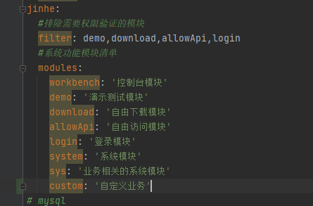

# 架构说明

## 基本结构

+ com.jinhe 主目录
    + common 公共模块框架级别维护（一般开发人员不改 框架级别的修改）
        + annotation aop注解类
        + aspect aop切面方法
        + config 框架配置项
        + exception 自定义异常处理
        + util 工具类
        + XSS xss过滤
    + config 程序配置 开发人自己可以改的
    + datasources 多数据源配置
    + modules 业务功能模块
        + allowApi 不需要权限就可以访问的接口
        + base 基础控制器类 所有的控制器都要继承这个控制器
        + demo 演示使用的模块
        + login 登录模块
        + sys admin系统管理员模块
        + system rootAdmin 超级管理员使用模块
        + workbench 页面控制台统计模块
+ resources 资源模块
    + config 废弃使用
    + mapper xml查询文件
        + demo
        + sys
        + system
        + workbench
    + application.yml 通用配置文件
    + application-dev.yml 开发配置文件
    + application-prod.yml 发布配置文件
    + logback-spring.xml 日志文件
    + webapp 网页文件存放位置
+ upload 文件上传存放位置

## 使用帮助

    在数据库中建好业务表
    在com.jinhe.config.CodeGeneratorMySql 修改数据库连接方式然后右键run
    输入模块名称 模块名称根据实际业务进行编写 然后回车 然后输入表名称多个使用英文逗号分割。


在资源文件 application.yml 中jinhe--modules 下添加模块名称


生成的控制器上添加 api表示和继承BaseController 如下图所示：

BaseController 提供获取用户id getUserId 和baseUserinfo 用户基本信息

注意事项： 单表的增删改查尽量使用mybatis_plus 自带的增删改查 涉及复杂的时候使用xml编写sql语句

#### 常量定义

+ 系统全局常量定义在com.jinhe.common.config.LongSwingConstants  com.jinhe.common.config.SystemType
+ 业务相关的常量定义在com.jinhe.config.LongSwingConstants 根据实际业务定义 开发人员主要在这里定义常量

#### 定义返回码 全局返回码和自定义返回码
+ 全局返回码 
    + SystemResultEnum 系统用户 角色 机构 字典等信息的返回码
    + ResultEnum 通用框架返回码
+ 自定义返回吗 code码以10000 以上作为标识 10001 com.jinhe.config.BusinessResultEnum
   ```java
    public static final ResultEnum CUSTOM_DEMO = new ResultEnum(10001, "业务返回码示例");
```
#### 各层命名规约

+ Controller/Service/DAO 层方法命名规约
    + 获取单个对象的方法用 get 做前缀。
    + 获取多个对象的方法用 list 做前缀，复数结尾，如：listObjects。
    + 获取统计值的方法用 count 做前缀。
    + 插入的方法用 save/insert 做前缀。
    + 删除的方法用 remove/delete 做前缀。
    + 修改的方法用 update 做前缀。

#### 领域模型命名规约

+ 数据对象：xxxDO，xxx 即为数据表名。
    + 数据传输对象：xxxDTO，xxx 为业务领域相关的名称。Java 开发手册
    + 展示对象：xxxVO，xxx 一般为网页名称。
    + POJO 是 DO/DTO/BO/VO 的统称，禁止命名成 xxxPOJO。
